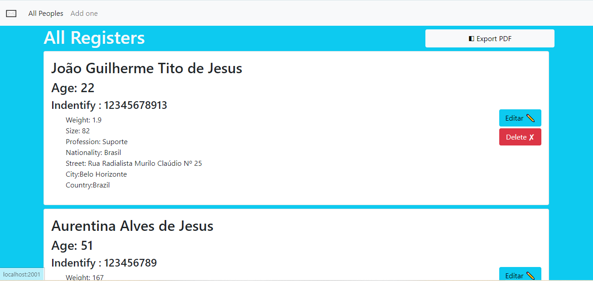

# CadPeople Register
## Indice 👨‍💻
1. **Introdução**
1. **Desenvolvimento**
1. **Como Usar**
1. **Outras Coisa Não Tão relavantes**

## Edições ✏️📑

Alterações   | Data
:---------: | :------:
Emissão Inicial | 11/12/2021
Vazio | Vazio

### Tecnologias Usados
#### 🧑‍💻 No front-end
**_HTML_**

**_CSS_**

**_Javascript_**

**_Framework CSS Bootstrap_**

#### 👥 No Back-end
**_NODE js_**

**_MongoDb_**

**_e Ejs_**

### 1. 🚪 Introdução

Isto é um pequeno sistema de cadastro de pessoas criado, para, treinamento da minha estruturacão de código na parte de servidor em node.
Cujo o usuário pode cadastrar pessoas atráves de uma simples simples tela, assim que o cadastro e feito, ele será listado entre os cadastrados.

### 2. Desenvolvimento ⚙️

Primeiramente, vale resaltar que utilizei o tipo de arquitetura **MVC**

Como citado acima esse projeto foi desenvolvido com instuito 
de treinamento na parte Back-end , usei no **Nodejs, Express , MondoDb**
para construir API ,que é local. 

Já no Front-end rendenizei as coisa os template no servidor usando
uma bibloteca chamada de **EJS** e com auxilio do **Framework Bootstrap**.

### 3. 👇🤘 Para Usar
1.Tenha um **NODEjs** e **mongoDB** instalado.
1. Clone o projeto 
1. Entre no Diretorio no **CMD ou em Outro terminal** de comando.
1. Entre na pasta pelo caminho dela.
1. Em seguida entre dentro da pasta **Aplics**.
1. Veja se a **_porta 2001_** esta sendo usada em seu PC, se sim, edite o arquivo **initialize.js** e troque e linha 5 chamado **port**, para porta que deseje.

        const port = 2001; // Mude a porta

6.Após volte para pasta **Aplics** e  digite seguinte comando abaixo:

        node initialize.js

7. Esse comando irá iniciar o servidor....

Falta algumas coisas como tratar problemas de CORS, mas com o tempo irei atualizar essas coisa que faltam.

No mais muito obrigado a todos que visualizaram, caso alguma dúvida pode entrar em contato aqui pelo 😁 **Github**.

## 4. Outras Coisa Não Tão relavantes 📁😅🤪...

Na estrutura de diretorios há 2 pastas principais:

### Aplics 📁
Onde estão todo o codigo fonte da Aplicação 
### Documents 🗃️📋 
Onde estão esta colocado toda documentação, as 
dependencias que eu estou usando entre outras coisa, serve para que eu lembre mesmo de todas 😅 
### what-Dependecias
Meu gerador de arquivos quando preciso gerar algo repetivo, comando para lembra ou outras coisa crio esse coisinham para automatizar. 😅
### fileCreatorServer.bat ⚙️
Meu gerador de estrutura de codigo. Ele gera minhas pasta principais do Back-end. Otimizando o tempo na criacão de diretórios e arquivos. 🤗Ahh vale resaltar ele é baseado no **MVC**.

